```mdx-code-block
import UnderLine from "@site/src/components/Custom/UnderLine"
import FontColor from "@site/src/components/Custom/FontColor"

```

:::caution 注意事項
一個人の解答からここが根拠だろうという部分を取り出してまとめたものになります。
:::
以下の写真は全て実際の問題よりスクリーンショットで取得したものを表示させています。
また、「」内の文字は問題からそのまま引用しています。

## 午後 1

出典 : 平成 29 年度 春期 データベーススペシャリスト試験　午後 1

[問題](https://www.jitec.ipa.go.jp/1_04hanni_sukiru/mondai_kaitou_2017h29_1/2017h29h_db_pm1_qs.pdf)

[解答](https://www.jitec.ipa.go.jp/1_04hanni_sukiru/mondai_kaitou_2017h29_1/2017h29h_db_pm1_ans.pdf)

問題と解答は上記からダウンロードすることができます。

解答作成中

## 午後 2

出典 : 平成 29 年度 春期 データベーススペシャリスト試験　午後 2

[問題](https://www.jitec.ipa.go.jp/1_04hanni_sukiru/mondai_kaitou_2017h29_1/2017h29h_db_pm2_qs.pdf)

[解答](https://www.jitec.ipa.go.jp/1_04hanni_sukiru/mondai_kaitou_2017h29_1/2017h29h_db_pm2_ans.pdf)

問題と解答は上記からダウンロードすることができます。

### 大問 1

#### 設問 1

##### (1)

- $\textcircled{\scriptsize 1}$

  ページ 6 $\sim$ ページ 7 にかけて「 $\sim$ 使用したポイントは、即座に使用可能ポイントから差し引かれる。」と書かれている。
  また、ページ 8 $>$ (2) $>$ $\textcircled{\scriptsize 4}$に　
  「ポイント統合は申請の翌日以降に有効となり、店舗販売と OL 販売のどちらでもポイントを使用できるようにする。」と書かれている。
  さらに、ページ 11 $\sim$ ページ 12 にかけて「 $\sim$ 店舗販売システムと OL 販売システムの間で直接データ交換を行うのではなく、連携システムに、両システムのデータを一部を統合、
  一部を複製した上で、連携システムを介して双方の情報連携を行う。」と書かれているので、ポイント統合が行われている場合、
  店舗販売システムでポイントが使用された場合は OL 販売システムの使用可能ポイントが同期されていないと不正にポイントが使用される場合があるので、

  `ポイント統合後の会員が購入時にポイントを使用した場合`

  となる。

- $\textcircled{\scriptsize 2}$

  ロールバックを行う必要があるのでデータを追加・更新・削除を行なっていた場合なので、会員テーブルを追加・参照・削除行なっている

  `会員登録, POS入力, ポイント反映`

  となる。

##### (2)


- a

  ページ 8 $>$ (1) $>$ $\textcircled{\scriptsize 1}$に
  「店舗販売業務と OL 販売業務を統括する販売統括部を新設し、両業務に共通する商品情報及びそれに関連する商品分類情報を管理する。」と記載されており、
  店舗販売システムと OL 販売システムでは情報を共有していないが、情報共有対象のテーブルに小分類コードが存在するので情報共有テーブルから参照されるので
  (ⅱ), (ⅲ)の連携 AP となるので

  配置方法$\textcircled{\scriptsize 2}$

  となる。

- b

  a と同じで分類コードは情報共有対象テーブルから参照されているかつ、販売統括部の管理下なので、

  配置方法$\textcircled{\scriptsize 2}$

  となる。

- c

  店舗販売システムでしか使用しないテーブルで情報共有対象テーブルからも参照されていないので、
  (ⅰ), (ⅱ)ともに満たさないから

  配置方法$\textcircled{\scriptsize 1}$

  となる。

- d

  店舗販売システムと OL 販売システムともに倉庫在庫テーブルが存在し、CRUD をみると参照・追加・更新が行われているので(ⅰ)を満たす。
  (ⅲ)は現行システムで追加・更新が行われるので、現行 AP となる。
  また、ページ 9 $>$ (3) $>$ $\textcircled{\scriptsize 1}$に
  「全エリアの倉庫からの配送を可能にして、店舗販売業務の取扱商品の多くを OL 販売で取り扱えるようにする」、
  $\textcircled{\scriptsize 2}$に
  「エリアの倉庫在庫から他エリアの店舗へ出荷できるようにする。」とあるので、両システムで同期をとる必要があることが分かるので、(ⅳ)では同期が必要となる。
  店舗販売システムでは倉庫コードと商品コードが主キーとなっているが、OL 販売システムでは商品コードのみが主キーとなっているので、
  商品コードが同じで倉庫コードが違うという更新があった場合に主キーが等しい行に対する更新が同時に発生するので、

  配置方法$\textcircled{\scriptsize 5}$

  となる。

- e

  店舗販売システムでしか使用しないテーブルで情報共有対象テーブルからも参照されていないので、

  (ⅰ), (ⅱ)ともに満たさないから

  配置方法$\textcircled{\scriptsize 1}$

  となる。

#### 設問 2

##### (1)


ページ 8 $>$ (2) $>$ $\textcircled{\scriptsize 2}$に
「会員から申請があれば、ポイント統合を行う。統合後は、OL 販売の会員番号を正規の会員番号とし、ポイントを集約する。」とあるので、
集約先の会員番号をもつ必要があることが分かる。

ページ 8 $>$ (2) $>$ $\textcircled{\scriptsize 3}$に
「会員は、統合するポイントカードの店舗コードと店舗会員番号を指定する。複数のポイントカードのうち、1 枚だけを存続させ、その他は廃止する。」とあるので、
廃止された会員番号かどうかを判断する必要があるので`廃止区分`属性が必要であることが分かる。

ページ 8 $>$ (2) $>$ $\textcircled{\scriptsize 4}$に
「 $\sim$ ポイント統合の対象となったポイントカードの統合申請日、統合対象ポイント(統合時点の使用可能ポイント)を記録し、 $\sim$ 」とあるので、
ポイントカードの統合申請日と統合対象ポイントを持つ必要があることが分かる。

まとめると、

| 列名             | 列値の内容                         |
| ---------------- | ---------------------------------- |
| 廃止区分         | ポイントカードの廃止有無を表す値   |
| 統合先会員番号   | ポイント統合後の統合先の会員番号   |
| 統合申請日       | ポイント統合の申請日               |
| 統合対象ポイント | ポイント統合時点の使用可能ポイント |

となる。

制約については、統合区分が統合済みである場合は既に統合されているはずなので統合先会員番号は NULL ではないということが分かる。
また、統合されるのは会員区分が店舗会員だけであるので、

`会員区分が店舗会員かつ統合区分が統合済みの場合、統合先会員番号はNULLでない`

となる。

##### (2)


- 権限の付与先

  ページ 15 $>$ 2. 会員の個人情報漏えい防止対策 $>$ $\textcircled{\scriptsize 1}$, $\textcircled{\scriptsize 2}$に　
  「会員番号、氏名、ポイントは全従業員に全会員の情報参照を許す。それ以外の情報(以下、機密情報という)の参照は、必要とする特定の役職及び特定の担当職務の従業員に限定する。」,
  「機密情報の参照が認められた従業員であっても、参照できるのは従業員が所属する店舗の登録会員の情報だけに限定する。」とある。
  また、ページ 12 $>$ 1, 権限 $>$ (3)に「テーブル、ビューのアクセス権限は、ユーザ ID, ロールに付与される。ロールは、ユーザ ID 及び他のロールに付与される。」とあるので
  会員ビュー V1 は会員番号, 氏名, ポイントを取得していることから

  `全従業員のユーザID`

  となる。

  会員ビュー V2 は機密情報となり、ページ 16 $>$ (2) $>$ $\textcircled{\scriptsize 4}$に
  「 $\sim$ 機密情報へのアクセス制御には、認可役職ロール、認可担当職務ロールを用いる。」とあるので、

  `認可役職ロール及び認可担当職務ロール`

  となる。

- g

  ページ 16 $>$ (2) $>$ $\textcircled{\scriptsize 5}$に
  「図 5 の SQL 文で作成したビューでは、従業員が所属する店舗の会員情報だけにアクセスを限定する。ただし、ポイント統合後の店舗会員については、統合先の OL 会員情報も参照可能とする。」とあるので、
  所属する店舗の会員情報と統合先の会員情報の 2 種類を SQL 文を考える必要があることがわかり、図 5 には UNION 句で 2 つの SQL を合わせている。
  初めの SELECT 文の方がシンプルに記述されているので所属する店舗の会員情報の部分であることが分かる。

  接続した従業員の情報が必要になるので

  `従業員`

  となる。

- h

  接続に用いられたユーザ ID は`CURRENT_USER`で分かるので、CURRENT_USER と従業員テーブルの従業員 ID を突き合わせることで特定の従業員の情報を取得することが可能であり、
  従業員テーブルには所属する店舗の情報が記載されているので、

  ```sql
  SELECT A.* FROM 会員 A INNER JOIN 従業員 B ON A.店舗コード = B.店舗コード AND B.従業員ID = CURRENT_USER
  ```

  となることから

  `A.店舗コード = B.店舗コード AND B.従業員ID = CURRENT_USER`

  となる

- i

  会員と会員とで内部結合しているので、統合先の会員情報を取得するために結合していると分かるので、

  `A.会員番号 = B.統合先会員番号`

  となる。

- j

  h と同じで同じ店舗の情報を見ることができるようにするので、

  `C.店舗コード = B.店舗コード AND C.従業員 = CURRENT_USER`

  となる。

  ※A.店舗コード ではなく B.店舗コードとなるのは、所属している店舗会員の統合先の会員情報を参照可能であるからである。

##### (3)

- 日締処理で行う操作

  ページ 16 $>$ 3. 販売分析データの作成(バッチ処理)に
  「 $\sim$ 店舗販売業務、OL 販売業務では、それぞれ、その日のうちに日締めを行なっているが、日締時刻は日によって異なり、順序も決まっていない。 $\sim$ 」
  とあるので、どちらが先に実行されても問題ないような処理が行われていることがわかる。
  また、ページ 17 の図 6 を見ると、

  

  主キーに処理年月日となっているのでデータの挿入 1 度しか行われないことも分かる。さらに、テーブルが存在している場合はもう一方の日締処理は行われていることが分かる。

  これらをまとめて考えると

  `行がなければ対応するフラグを完了、他方を未完了として行を追加し、行があれば対応するフラグを完了にして更新する`

  となる。

- トリガの定義内容

  トリガで行われる内容は ページ 16 $>$ 3. 販売分析データの作成(バッチ処理)に
  「 $\sim$ バッチ処理中の元データ更新を避けるため、両業務とも日締めが完了したときに、該当テーブルのレプリケーションを自動的に無効化する。 $\sim$ 」
  と書かれている。

  - $\textcircled{\scriptsize 1}$

    ページ 12 $>$ 2. トリガに「テーブルに対する操作(追加・更新)を契機に、あらかじめ定義された処理を実行する。実行タイミング(追加・更新の前又は後)、列値による実行条件を定義することができる。」
    とあるので、

    `更新`

    となる。

  - $\textcircled{\scriptsize 2}$

    実行条件は上記に書かれているとおりに

    `店舗日締フラグとOL日締フラグが共に完了であること`

    となる。

  - $\textcircled{\scriptsize 3}$

    行われる処理も上記に書かれているとおりに

    `レプリケーションを無効化する`

    となる。

#### 設問 3

##### (1)


- 追加するテーブル

  ページ 9 $>$ (4) $>$ $\textcircled{\scriptsize 2}$に　
  「会員の性別、居住地域(関東、東海など)、年齢層(10 代、20 代など)を用いて分析を行う。」と書かれているが、テーブルに会員の情報が何もないので、会員についてテーブルを追加することがわかる。
  店舗軸・商品軸のように書かれているので会員軸というテーブル名になることがわかり、主キーは会員軸 ID となる。属性については、分析を行うものについて列挙されているので、
  性別、居住地域、年齢層であることが分かるので、まとめると

  > 会員軸 : <UnderLine>会員軸 ID</UnderLine>, 性別, 居住地域, 年齢層

- k

  販売ファクトテーブルにはそれぞれの軸の ID が外部キーとして設定されているので、追加した会員軸を外部キーとして設定する必要があるので、

  `会員軸ID`

  となる。

- l

  ページ 9 $>$ (4) $>$ $\textcircled{\scriptsize 1}$に
  「店舗販売と OL 販売をチャネル区分で識別し、チャネル横断的に販売分析処理を行えるようにする。」と書かれているので、

  `チャネル区分`

  となる。

- m

  ページ 9 $>$ 表 1 $>$ 処理例 1 に「OL 販売業務で用いている商品分類を第 1 $\sim$ 3 階層の範囲内から選択し、 $\sim$ 」とあり、問題文には
  「〔販売業務改善の要件〕に従って、表 1 の販売分析処理が可能となるように、 $\sim$ 」とあるので、

  `分類コード1`, `分類コード2`, `分類コード3`

  となる。

##### (2)

- ア

  ページ 9 $>$ 表 1 $>$ 処理例 2 に「 $\sim$ 関東地域に居住する 30 代の女性が購入した $\sim$ 」とあるので、会員軸で結合を行うことが分かるので

  `会員軸`

  となる

- イ

  $\textcircled{\scriptsize 2}$を参考にして書くと、

  `会員軸IDで等結合し、性別が女性、かつ、年齢層が30代、かつ、居住地域が関東地域と一致する行を選択`

  となる。

- ウ

  ページ 9 $>$ 表 1 $>$ 処理例 2 に「 $\sim$ 店舗販売の大分類コードが'K001'(キッチン用品)の件数を $\sim$ 」とあるので

  `商品軸`

  となる。

- エ

  $\textcircled{\scriptsize 2}$を参考にして書くと、

  `商品軸IDで等結合し、大分類コードが'K001'と一致する行を選択`

  となる。

### 大問 2

#### 設問 1

関係スキーマから解答する

##### (2)


- a

  ページ 21 $>$ 1. 自社組織・得意先・商品 $>$ (1) $>$ $\textcircled{\scriptsize 1}$に
  「拠点の種類は拠点種類区分で分類している。拠点は拠点コードで識別し、拠点名を保持している。」と書かれているので

  > 拠点名, 拠点種類区分

  となる。

- b

  ページ 21 $>$ 1. 自社組織・得意先・商品 $>$ (1) $>$ $\textcircled{\scriptsize 3}$に
  「本社には、幾つかの販売部がある。販売部と営業所を合わせて営業部門と呼び、営業部門コードで識別している。 $\sim$ 」とあり、
  営業部門のサブタイプとなることが分かる。営業所にはすでに主キーとして拠点コードが設定されており、営業部門コードも主キーとして
  設定してしまうと複数の拠点に複数の営業所が存在することになり、拠点名と営業所の 1 対 1 の関係が成り立たなくなるので、外部キーとして持つことがわかる。
  また、図 3 の E-R 図を見ると物流センターから矢印が出ているので、

  > <UnderLine style="dotted">
  >   営業所営業部門コード
  > </UnderLine>, <UnderLine style="dotted">物流センタ拠点コード</UnderLine>

  となる。

- c

  ページ 21 $>$ 1. 自社組織・得意先・商品 $>$ (1) $>$ $\textcircled{\scriptsize 3}$に
  「 $\sim$ 営業部門が、販売部と営業所のどちらに該当するかは、営業部門区分で分類している。」とあるので、

  > 営業部門区分

  となる。

- d

  ページ 21 $>$ 1. 自社組織・得意先・商品 $>$ (2) $>$ $\textcircled{\scriptsize 2}$に
  「 $\sim$ 得意先が請求得意先に該当するか否かは、請求得意先フラグで識別する。請求得意先は、請求書を集約する対象の得意先をもつ。」とあり、
  得意先は請求得意先のスーパタイプであることが分かる。請求得意先のテーブルを見ると集約先の得意先を持つと書かれているのにも関わらず、テーブルに定義されていないので、
  スーパタイプの得意先で持つことが分かる。

  ページ 22 $>$ $\textcircled{\scriptsize 3}$に
  「得意先には、地域得意先と広域得意先があり、得意先区分で分類している。 $\sim$ 」とあるので、　
  地域得意先と広域得意先のスープタイプであることが分かる。
  まとめると、

  > 得意先区分, 請求得意先フラグ, <UnderLine style="dotted">請求得意先コード</UnderLine>

  となる。

- e

  ページ 22 $>$ $\textcircled{\scriptsize 3}$に
  「 $\sim$ 広域得意先に対する営業は、いずれかの販売部が担当する。 $\sim$」とあるので、担当販売部の情報を持つことが分かる。

  ページ 22 $>$ $\textcircled{\scriptsize 4}$に
  「 $\sim$ まとめて発注される各広域得意先は、どの発注得意先から発注されるか決められている。」とあるが、発注得意先テーブルは発注得意先についての項目を定義していないので、
  スーパタイプである広域得意先で持つことが分かる。
  まとめると、

  > <UnderLine style="dotted">
  >   発注得意先コード
  > </UnderLine>, <UnderLine style="dotted">担当販売部営業部門コード</UnderLine>

  となる。

- f

  ページ 22 $>$ (3) $>$ $\textcircled{\scriptsize 3}$に
  「商品ごとに生産する工場を決めており、生産する工場の拠点コードと生産ロットサイズを設定している。」とあるので、

  > <UnderLine style="dotted">生産工場拠点コード</UnderLine>

  となる。

- g

  ページ 23 $>$ (3) $>$ $\textcircled{\scriptsize 1}$に
  「在庫には、基準在庫数量と補充ロットサイズを設定している。」とあり、
  基準在庫数量と補充ロットサイズを持つことが分かる。

  また、ページ 23 $>$ (3) $>$ $\textcircled{\scriptsize 2}$に
  「実在庫数量が基準在庫数量を下回った商品を対象に、1 日に 1 回、下位拠点から上位拠点に対してい商品の要求(以下、補充要求)を行い、 $\sim$ 」とあるので、
  実在庫数量を持つ必要があることが分かる。

  さらに、ページ 23 $>$ (6) $>$ $\textcircled{\scriptsize 2}$に
  「在庫引当ができた要求は、その要求分が出庫されるまで引当済数量に累積する。」とあるので、
  引当済数量も持つ必要があることが分かる。

  まとめると、

  > 基準在庫数量, 補充ロットサイズ, 実在庫数量, 引当済数量

  となる。

- h

  ページ 25 $>$ $\textcircled{\scriptsize 5}$に
  「注文の記録は、地域得意先納入と同じである。」と書かれており、ページ 25 $>$ $\textcircled{\scriptsize 4}$に
  「注文では、注文年月日、納入先の得意先、注文を受けた商品・数量を記録する。」と書かれているので、

  > <UnderLine style="dotted">広域得意先コード</UnderLine>

  となる。

- i

  ページ 25 $>$ $\textcircled{\scriptsize 5}$に
  「納入指示では、地域得意先納入の記録の他に、納入する物流センタを記録する。」とあり、
  地域地域得意先納入指示(納入指示)のサブタイプであることが分かる。また、物流センタを追加で記録されているので、

  > <UnderLine style="dotted">納入元物流センタ拠点コード</UnderLine>

  となる。

- j

  ページ 25 $>$ $\textcircled{\scriptsize 3}$に
  「補充要求では、要求年月日、要求元の拠点、要求した商品・数量を記録する。」とあり、
  ページ 23 $>$ (3) $>$ $\textcircled{\scriptsize 2}$に
  「実在庫数量が基準在庫数量を下回った商品を対象に、1 日 1 回、下位拠点から上位拠点に対して商品の要求(以下、補充要求という)を行い、上位拠点から下位拠点に商品が補充される。」
  と書かれているので、要求した商品・数量は複数存在することが分かるので、補充要求明細テーブルが必要となる。
  補充要求と補充要求明細には要求元の拠点が書かれていないので、

  > <UnderLine style="dotted">要求元営業所拠点コード</UnderLine>

  となる。

- k

  ページ 24 $\sim$ 25 $>$ $\textcircled{\scriptsize 2}$に
  「生産では、生産年月日、生産した商品、生産数量、生産した商品の入庫先物流センタを記録する。」と書かれているので、

  > <UnderLine style="dotted">入庫先物流センタ拠点コード</UnderLine>

  となる。

##### (1)


- 拠点

  ページ 21 $>$ 1. 自社組織・得意先・商品 $>$ (1) $>$ $\textcircled{\scriptsize 1}$に　
  「拠点の種類は拠点種類区分で分類している。 $\sim$ 」とあるので、`工場`, `物流センタ`, `営業所`のスーパであることが分かるので、

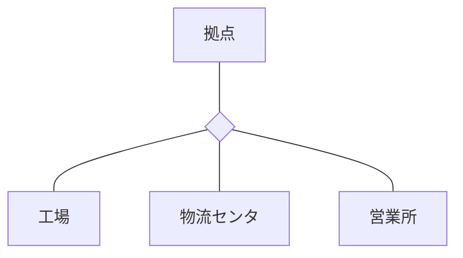

- 工場

  外部キーがないので、特になし

- 物流センタ

  外部キーがないので、特になし

- 営業所

  外部キーとして`営業所営業部門コード`と`物流センタ拠点コード`が存在している。
  ページ 21 $>$ 1. 自社組織・得意先・商品 $>$ (1) $>$ $\textcircled{\scriptsize 1}$より、物流センタ 18 個に対して、
  営業所は 76 個存在しているとあり、 $\textcircled{\scriptsize 2}$に
  「工場 $\rightarrow$ 物流センタ $\rightarrow$ 営業所」の向きに商品が流れるので、 $\sim$」とあるので、
  物流センタ $\rightarrow$ 営業所となる。

  営業所営業部門コードはページ 21 $>$ 1. 自社組織・得意先・商品 $>$ (1) $>$ $\textcircled{\scriptsize 3}$に　
  「本社には、幾つかの販売部がある。販売部と営業所を合わせて営業部門と呼び、営業部門コードで識別している。 $\sim$ 」とあるので、
  営業部門のサブタイプとなることが分かるので(営業部門の時に関係は図示する)、

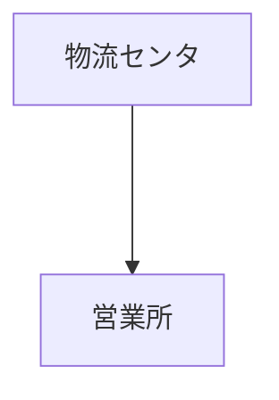

- 営業部門

  上記の営業所の項目より、営業所と販売部のスーパタイプとなっているので、

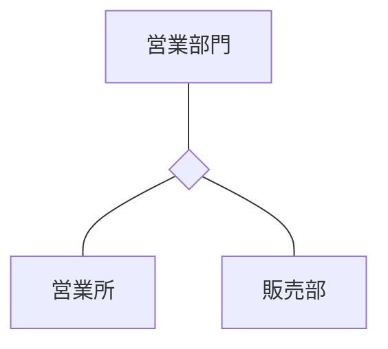

- 販売部

  外部キーがないので、特になし

- 得意先

  ページ 21 $>$ (2) $>$ $\textcircled{\scriptsize 2}$から請求得意先のスーパタイプとなっていることが分かる。
  また、外部キーとして請求得意先コードを持っており、「請求書を集約する対象の得意先をもつ。」
  とあるので、請求得意先 $\rightarrow$ 得意先となる。

  さらに、ページ 23 $>$ $\textcircled{\scriptsize 3}$から地域得意先と広域得意先のスーパタイプとなっていることがわかる。

  まとめると、

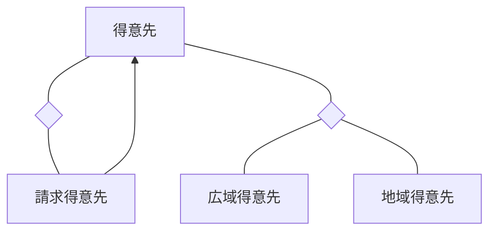

- 請求得意先

  外部キーがないので、特になし

- 地域得意先

  ページ 22 $>$ $\textcircled{\scriptsize 3}$に「地域得意先に対する営業は、その地域得先を受け持つ営業所が担当する。」と
  書かれているので、1 つの地域得意先に対して、複数の営業所が担当することはない。また、得意先はページ 21 $>$ (2) $>$ $\textcircled{\scriptsize 1}$に「
  「得意先は店舗単位に登録し、得意先コードで識別している。」とページ 22 $>$ $\textcircled{\scriptsize 3}$に
  「 $\sim$ 地域得意先は店舗が 1 $\sim$数店の規模のところであり、 $\sim$ 」とあるので、1 つの営業所は複数の地域得意先を持つことが分かるので、

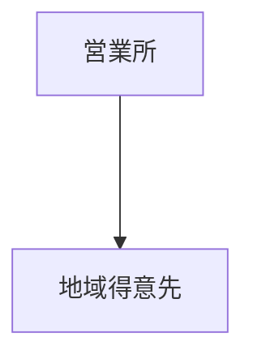

- 広域得意先

  ページ 22 $>$ $\textcircled{\scriptsize 4}$から発注得意先のスーパタイプとなっていることがわかる。
  また、発注得意先コードを外部キーとしてもち、「まとめて発注されるかく広域得意先は、どの発注得意先から発注されるか決められている。」とあるので、
  発注得意先 $\rightarrow$ 広域得意先 となることが分かる(まとめ先の得意先コードを保持しているから)。

  さらに、ページ 22 $>$ $\textcircled{\scriptsize 3}$に「広域得意先に対する営業は、いずれかの販売部が担当する。」とあり、
  得意先の単位が店舗単位であるので、販売部 $\rightarrow$ 広域得意先

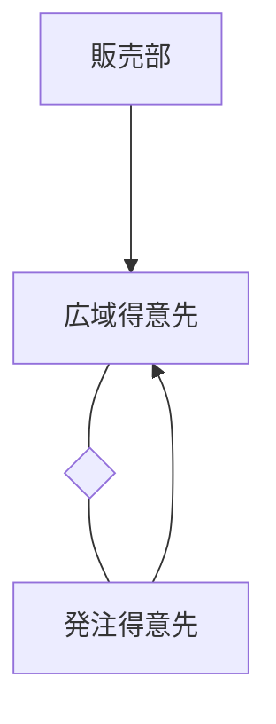

- 発注得意先

  外部キーがないので、特になし

- 商品

  外部キーとして生産工場拠点コードが存在し、ページ 22 $>$ (3) $>$ $\textcircled{\scriptsize 3}$に「商品ごとに生産する工場を決めており、 $\sim$ 」
  と書かれているので(工場 3 つに対してそれ以上に商品が存在するので)、

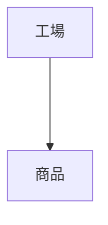

- 在庫

  主キーが拠点コードと商品コードの複合キーとなっているので、拠点・商品それぞれに対して 1 対多と多対 1 の関係となることが分かるので、

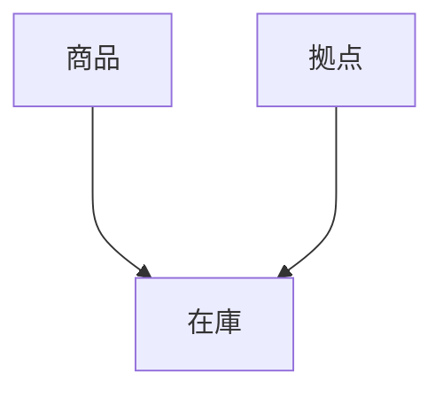

(ページ 22 $>$ (3) $>$ $\textcircled{\scriptsize 4}$に「商品には、計画生産ヒント補充生産品の 2 種類がある。」と書かれており、
ページ 23 $>$ $\textcircled{\scriptsize 1}$, $\textcircled{\scriptsize 2}$に
「計画生産品の在庫は、営業所及び物流センタにもたせる」, 「補充生産品の在庫は、営業所及び物流センタの他に工場にももたせる」
と書かれている。これらより、商品(の在庫)と保管拠点は多対多の関係となっていることが分かる。)

- 月別商品別物流センタ別入庫計画

  主キーが物理センタ拠点コードと商品コードの複合キーとなっているので、物理センタ・商品それぞれに対して 1 対多と多対 1 の関係となることが分かるので、

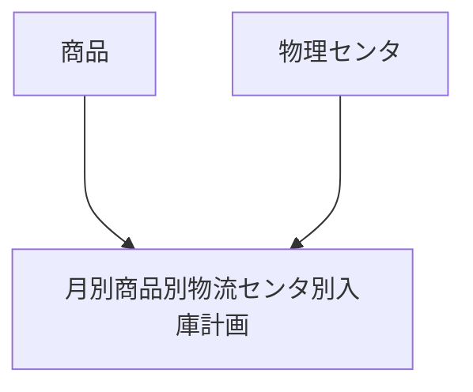

- 注文

  マスタ・在庫領域に関係するものがない。

- 地域得意先注文

  外部キーとして地域得意先コードが存在しており、ページ 22 $>$ 2. 業務の方式 $>$ (1) $\textcircled{\scriptsize 2}$に
  「ただし、同一の得意先からの別の注文に対してまとめて納入指示を行うことはない。」と書かれており、1 つの得意先から複数の注文があることが分かるので、

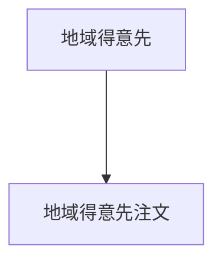

- 広域得意先注文

  外部キーとして広域得意先コードが存在しており、上記の地域得意先注文と同様に 1 つの得意先から複数の注文があることが分かるので、

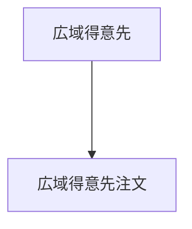

- 注文明細

  外部キーとして、商品コードと注文番号が存在しており、注文番号は注文番号明細との複合キーとなっているので、同じ注文番号は複数存在する可能性があるので、
  注文 $\rightarrow$ 注文明細となることが分かる。複数の注文が存在するので同じ商品が注文されることもあるので、

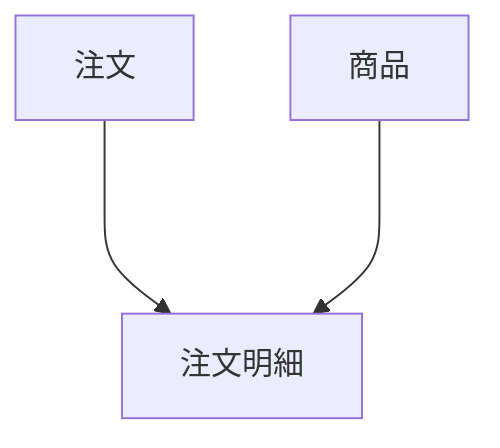

- 納入指示

  マスタ・在庫領域に関係するものがない。

- 広域得意先納入指示

  外部キーとして納入元物流センタ拠点コードがあり、ページ 22 $>$ 2. 業務の方式 $>$ (1) $\textcircled{\scriptsize 2}$に
  「 $\sim$ 分納は、まず納入可能な一部数量の納入指示を行う。不足分は、在庫が補充され次第、納入指示を行う。 $\sim$ 」と書かれており、
  納入指示が分かれて行われることがあるので、

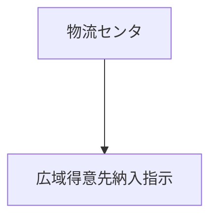

- 納入指示明細

  マスタ・在庫領域に関係するものがない。

- 納入

  マスタ・在庫領域に関係するものがない。

- 納入明細

  マスタ・在庫領域に関係するものがない。

- 補充要求

  外部キーとして要求元営業所拠点コードが存在し、ページ 23 $>$ (3) $>$ $\textcircled{\scriptsize 2}$に
  「実在庫数量が基準在庫数量を下回った商品を対象に、1 日 1 回、下位拠点から上位拠点に対して商品の要求(以下、補充要求という)を行い、上位拠点から下位拠点に商品が補充される。」
  とあり、1 日 1 回行われるので、数日たつと同じ営業所を要求元とすることが容易に考えられるので、

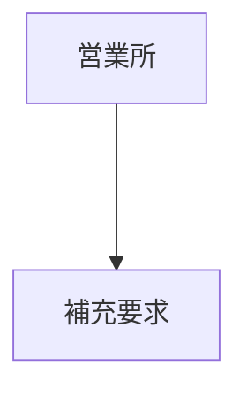

- 補充要求明細

  外部キーとして商品コードが存在しており、ページ 23 $>$ (3) $>$ $\textcircled{\scriptsize 3}$に
  「補充要求に対して、要求を受けた上位拠点で在庫が不足していた場合、不足した商品を当日の補充対象から外す。翌日以降に、在庫が補充要求を満たした時点で補充を行う。 $\sim$ 」
  とあり、同じ商品が何度も指定されることがあることが分かるので、

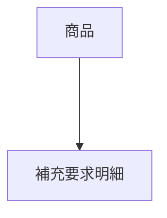

- 補充出庫

  マスタ・在庫領域に関係するものがない。

- 補充出庫明細

  マスタ・在庫領域に関係するものがない。

- 補充入庫

  マスタ・在庫領域に関係するものがない。

- 補充入庫明細

  マスタ・在庫領域に関係するものがない。

- 生産

  外部キーとして商品コードと入庫先物流センタ拠点コードが存在し、ページ 23 $>$ (4) $>$ $\textcircled{\scriptsize 1}$,$\textcircled{\scriptsize 4}$に
  「四半期ごとに、販売目標と販売実績から向こう 12 ヶ月分の需要を予測する。」と
  「工場は、月別商品別物流センタ別入庫計画の計画値に対する実績値の割合が低い商品について、入庫先物流センタを決めて生産し、その都度、生産入庫を行う。」と書かれており、
  特定の商品を特定の物流センタに生産入庫を複数回行うことが分かるので、

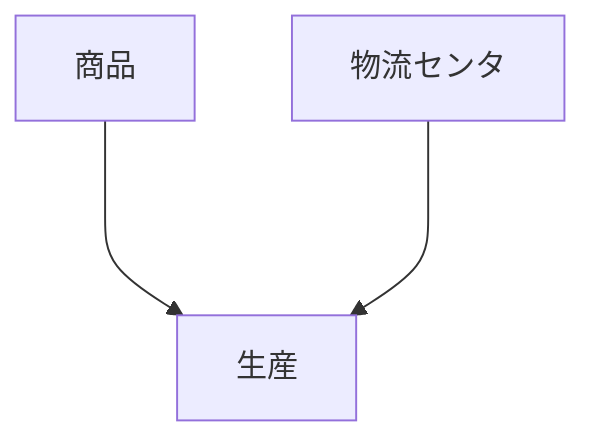

- 生産入庫

  マスタ・在庫領域に関係するものがない。

#### 設問 2

##### (1)


ページ 25 $>$ (2)に「 $\sim$ 営業所補充、地域得意先納入、広域得意先直納は、計画生産品と同一業務なので、ここでは物流センタ補充、生産の業務の流れだけを図 2 に示す。」とあるので、
基本的には計画生産品と同様であることが分かる。

- 物流センタ補充要求

  図から物流センタ補充要求は補充要求のサブタイプであることが読み取れる。また、同じサブタイプである営業所補充要求は
  補充要求番号を主キーかつ外部キーとしているので、物流センタ補充要求も同様であると考えることができるので、補充要求番号は`KF`となる。

  また、物流センタと名称がついているので、物流センタ拠点コードも属性として持っていると考えられるので、物流センタ拠点コードは`AF`となる。

- 補充要求明細

  補充要求明細は特に変更する必要がないため、計画生産品の関係スキーマから
  補充要求番号 `KF`, 補充要求明細番号 `K`, 補充要求数量 `A`, 補充生産品商品番号 `AF`となる。

- 補充出庫

  補充出庫は特に変更する必要がないので、計画生産品の関係スキーマから
  補充要求番号 `AF`, 補充番号 `K`, 補充出庫年月日 `A`となる。

- 補充出庫明細

  補充出庫明細は特に変更する必要がないので、計画生産品の関係スキーマから
  補充要求番号 `AF`, 補充要求明細番号 `AF`, 補充番号 `KF`, 補充明細番号 `K`, 補充出庫数量 `A`となる。

- 補充入庫

  主キーが補充出庫と同じなので 1 対 1 の関係となる。
  補充入庫は特に変更する必要がないので、計画生産品の関係スキーマから
  補充番号 `KF`, 補充入庫年月日 `A`となる。

- 補充入庫明細

  補充入庫は特に変更する必要がないので、計画生産品の関係スキーマから
  補充番号 `KF`, 補充明細番号 `KF`, 補充入庫年月日 `A`となる。

##### (2)


- 注文

  ページ 22 $>$ 2. 業務の方式 $>$ (1) $>$ $\textcircled{\scriptsize 1}$に
  「得意先から注文を受けると、在庫を確認し、納入指示を行う。」と書かれており、注文と得意先が結びついてることが分かる。
  得意先には地域得意先と広域得意先の 2 種類存在するので、それぞれの注文に分けることが予想され、E-R 図にはすでそのように書かれており、注文は
  地域得意先注文と広域得意先注文のスーパタイプとなっているので、

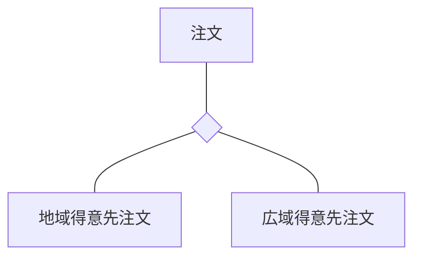

- 地域得意先注文

  図 5 に関係する外部キーが存在しないので、特になし。

- 広域得意先注文

  図 5 に関係する外部キーが存在しないので、特になし。

- 注文明細

  外部キーとして、商品コードと注文番号が存在しており、注文番号は注文明細番号との複合キーとなっているので、同じ注文番号は複数存在する可能性があるので、
  注文 $\rightarrow$ 注文明細となることが分かる。商品は図 5 に関係する外部キーではないので図示する必要がない。

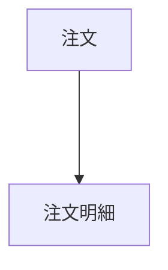

- 納入指示

  納入指示は計画生産品と変わらないので、計画生産品の関係スキーマから、
  外部キーとして、注文番号が存在しており、ページ 22 $>$ 2. 業務の方式 $>$ $\textcircled{\scriptsize 1}$に
  「注文に対して在庫が不足すると、得意先と調整して分納する。分納は、まず納入可能な一部数量の納入指示を行う。 $\sim$ 」と書かれており、
  注文 $\rightarrow$ 納入指示であることが分かる。

  また、ページ 25 $>$ $\textcircled{\scriptsize 5}$に
  「納入指示では、地域得意先納入の記録のほかに、納入する物流センタを記録する。」とあり、物流センタ以外は同じ属性であることがわかるので、
  広域得意先納入指示のスーパタイプとなっていることが分かるので、

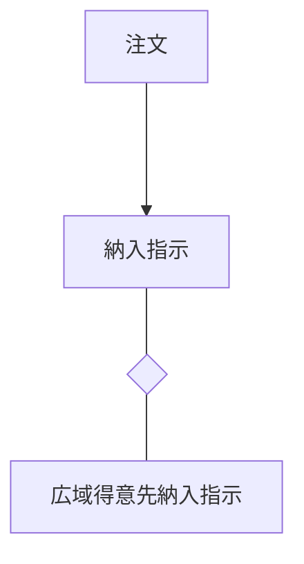

- 広域得意先納入指示

  図 5 に関係する外部キーが存在しないので、特になし。

- 納入指示明細

  外部キーとして、納入番号と注文番号と注文明細番号が存在しており、納入番号は納入明細番号との複合キーとなっているので、同じ納入番号は複数存在する可能性があるので、
  納入番号 $\rightarrow$ 納入指示明細となることが分かる。

  また、上記の分納より注文明細 $\rightarrow$ 納入指示明細となることが分かるので、

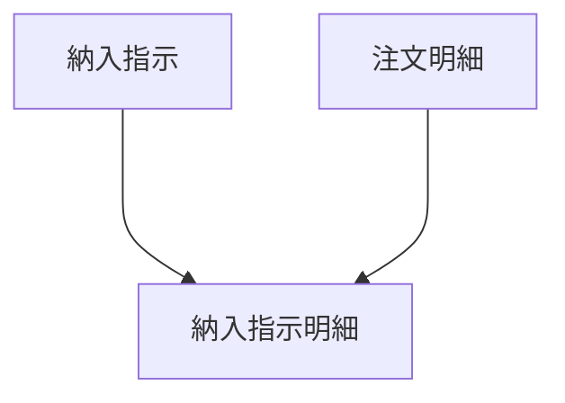

- 納入

  主キーが納入番号であることから納入指示と 1 対 1 の関係となることが分かるので、

```mermaid
flowchart TD
  A[納入指示] ---> B[納入]
```

- 納入明細

  主キーが納入番号と納入明細番号であることから納入指示明細と 1 対 1 の関係となることが分かるので、

```mermaid
flowchart TD
  A[納入指示明細] ---> B[納入明細]
```

- 補充要求

  [(1)](#1-4)の表より営業所補充要求と物流センタ補充要求のスーパタイプとなることが分かるので

```mermaid
flowchart TD
  A[補充要求] --- B{ }
  B --- C[営業所補充要求]
  B --- D[物流センタ補充要求]
```

- 補充要求明細

  外部キーとして、商品コードと補充要求番号が存在しており、補充要求番号は補充要求明細番号との複合キーとなっているので、同じ補充要求番号は複数存在する可能性があるので、
  補充要求 $\rightarrow$ 補充要求明細となることが分かる。商品は図 5 に関係する外部キーではないので図示する必要がない。

```mermaid
flowchart TD
  A[補充要求] ---> B[補充要求明細]
```

- 補充出庫

  [(1)](#1-4)の表より補充要求番号が外部キーとして存在することが分かる。また、ページ 23 $>$ (3) $>$ $\textcircled{\scriptsize 3}$に
  「補充要求に対して、要求を受けた上位拠点で在庫が不足していた場合、不足した商品を当日の補充対象から外す。翌日以降に、在庫が補充要求を満たした時点で補充を行う。 $\sim$ 」
  と書かれているので、補充出庫は補充できる時のみ処理されることが分かる。そのため、複数の商品を補充要求したとしても在庫が存在するものだけが出庫されるので、
  補充要求が複数回の補充出庫に分割される場合があるので、

```mermaid
flowchart TD
  A[補充要求] ---> B[補充出庫]
```

- 補充出庫明細

  外部キーとして、補充番号と補充要求番号と補充要求番号が存在しており、補充番号は補充明細番号との複合キーとなっているので、同じ補充番号は複数存在する可能性があるので、
  補充出庫 $\rightarrow$ 補充出庫明細となることが分かる。また、上記に書いた通り、補充できる状態となった際に補充出庫が行われるので、補充要求明細と 1 対 1 の関係となるので、

```mermaid
flowchart TD
  A[補充出庫] ---> B[補充出庫明細]
  B --- C[補充要求明細]
```

- 補充入庫

  主キーが補充出庫と同じであるので、1 対 1 の関係となる。

```mermaid
flowchart TD
  A[補充出庫] --- B[補充入庫]
```

- 補充入庫明細

  外部キーとして、補充番号が存在しており、補充番号は補充明細番号との複合キーとなっているので、同じ補充番号は複数存在する可能性があるので、
  補充出庫 $\rightarrow$ 補充入庫明細

```mermaid
flowchart TD
  A[補充出庫] ---> B[補充入庫明細]
```

- 生産要求

  外部キーがないので、特になし

- 生産

  [(1)](#1-4)の表より主キーが生産要求と 1 対 1 の関係となるので、

```mermaid
flowchart TD
  A[生産要求] --- B[生産]
```

- 生産入庫

  [(1)](#1-4)の表より主キーが生産要求・生産と 1 対 1 の関係となり、ページ 26 $>$ $\textcircled{\scriptsize 2}$に
  「生産要求に基づいて生産し、生産入庫を行う。 $\sim$ 」と書かれているので、生産入庫は生産と紐づいてることが分かるので、

```mermaid
flowchart TD
  A[生産] --- B[生産入庫]
```

#### 設問 3

##### (1)


- 補充要求

  計画生産品と補充生産品のエンティティを統合するので、統合前の補充要求の属性を合わせる必要があるので
  `補充要求(計画生産品)`と`補充要求(補充生産品)`となる。

  - 営業所補充要求

    計画生産品はページ 23 $>$ $\textcircled{\scriptsize 1}$に
    「計画生産品の在庫は営業所及び物流センタにもたせる。」と書かれているので、下位 $\rightarrow$ 上位の方向は営業所 $\rightarrow$ 物流センタしか存在しないので
    営業所補充要求しか存在しない。そのため、`補充要求(計画生産品)`となる。

    補充生産品はページ 23 $>$ $\textcircled{\scriptsize 2}$に
    「補充生産品の在庫は営業所及び物流センタの他に工場にもたせる。」と書かれているので、下位 $\rightarrow$ 上位の方向は営業所 $\rightarrow$ 物流センタと
    物流センタ $\rightarrow$ 工場が存在する。補充生産品はすでにサブタイプとして分離しているので、`営業所補充要求(補充生産品)`となる。

  - 物流センタ補充要求

    上記より補充生産品にしか存在しないので、`物流センタ補充要求(補充生産品)`となる。

- 補充要求明細

  計画生産品と補充生産品のエンティティを統合するので、統合前の補充要求の属性を合わせる必要があるので
  `補充要求明細(計画生産品)`と`補充要求明細(補充生産品)`となる。

  - 計画生産品補充要求明細

    計画生産品と明記されているので`補充要求明細(計画生産品)`だけとなる。

  - 補充生産品補充要求明細

    補充生産品と明記されているので`補充要求明細(補充生産品)`だけとなる。

##### (2)


- ア

  生産要求は補充生産品にしか存在しないため、表 1 の生産要求の情報をそのまま関係スキーマとして保持するので

  > 生産要求年月日, 生産要求時刻, <UnderLine style="dotted">補充生産品商品コード</UnderLine>, 生産要求数量

  となる。

- イ

  表 1 の補充生産品の生産と図 4 の計画生産品の生産を見比べ、共通している項目を補充生産品生産と計画生産品生産のスーパタイプである生産に保持させるのが良いので、

  > 生産年月日, 生産数量

  となる。

- ウ

  表 1 の生産の中でイで取り上げていない属性を持つ必要があるので、

  > 生産完了時刻

  となる。

- エ

  図 4 の生産の中でイで取り上げていない属性を持つ必要があるので、

  > <UnderLine style="dotted">商品コード</UnderLine>, <UnderLine style="dotted">入庫先物流センタ拠点コード</UnderLine>

  となる。

- オ

  表 1 の生産入庫の生産と図 4 の生産入庫の生産を見比べ、共通している項目を生産入庫で保持すれば良いので、

  > 生産入庫年月日, 生産入庫数量

  となる。

- カ

  表 1 の生産入庫の中でオで取り上げていない属性を持つ必要があるので、

  > 入庫完了時刻

  となる。
