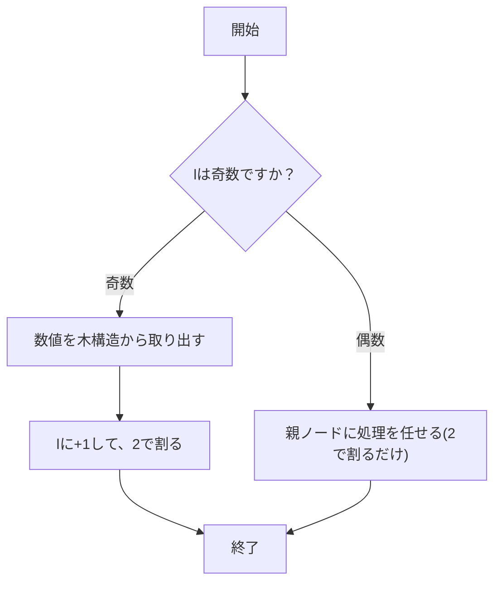
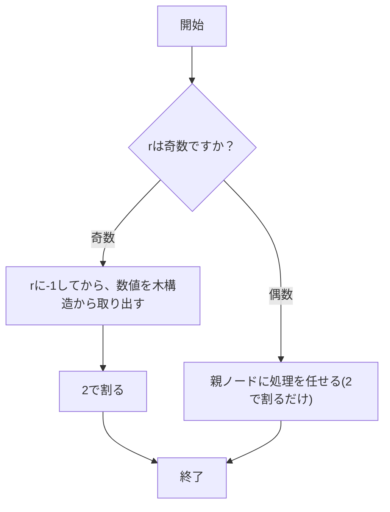

```mdx-code-block
import Tabs from '@theme/Tabs';
import TabItem from '@theme/TabItem';
import FontColor from "@site/src/components/Custom/FontColor"
```

## セグメント木とは

セグメント木とは区間に関する処理を行うの適したデータ構造であり、完全 2 分木で実装されている。
区間に対する処理が得意で

- 区間上の値を更新(1 点, 任意の区間問わず)
- 任意の区間上の最大値・最小値・合計などを取得

を O($log n$)で行うことができるデータ構造である。

### 構造

木構造で配列の最大値の求めることを考える。完全 2 分木なので、葉に配列の各値を保持するとすると、各ノードの親ノードに左子ノードと右子ノードを比較し、大きい方を保持する様にデータを持つと、
根に配列の中で一番大きいな値があり、葉を除く全てのノードは自分の子ノードよりも深さが深いノードの中で一番大きいな値となる。


この木構造を配列で持つことを考えると木構造番号(index 番号)は次の様になる。


木構造番号を 1 番(1-indexed)からにしているのは次の図の様に 2 進数で表した際に、綺麗な性質を持つからである。


例えば、木構造番号 3 番をみると、親ノードの木構造番号 1 番にアクセスするには 2 進数の右シフトを行うことでアクセスすることができ、
また、兄弟ノードである木構造番号 2 番には 1 と XOR を行うことでアクセスすることができる(反対の 2 番 $\rightarrow$ 3 番も 1 との xor で移動可能)。
さらに、自身の子ノードへは左子ノードには左シフトと 0 との OR 演算(不必要であるが、見やすくするために入れている)、
右子ノードへは左シフトと 1 との OR 演算でアクセスすることができる。

- 親ノードへのアクセス \>\> (右シフト)
- 兄弟ノードへのアクセス xor 1 (1 との XOR)
- 子ノードへのアクセス \<\< , | (0 か 1) (左シフトとの後に 0,1 どちらかと OR)

各ノードへ 2 進数の演算で簡単にアクセスできるので、要素を 1 番始まりにしている。各ノードのどこまでの情報を保持しているかを以下の図では表している。


木構造番号 4 番であれば、木構造番号 8, 9 番の大きい方の結果を保持し、木構造番号 2 番では木構造番号 4, 5 番の大きい方の結果を保持しているので、
木構造番号 8, 9, 10, 11 の中ので 1 番大きい結果を保持していると言える。つまり、木構造番号 1 番には全ての配列である 8 $\sim$ 15 番の中で一番大きいな結果を保持していると言える。

### 一点更新

特定の配列の要素の値が変化した場合(葉の要素が変更)は、それに合わせて、親ノードも変更されることがある。
そのため、要素が変化した際の影響範囲は図の様に自身が属しているブロックが存在するノードであることが分かる。


値が変更される可能性のある親ノードは 2 進数表記で表現すると簡単に見つけることが可能である。


図の様に最下位 bit を除く各 bit が親ノードと全く同じになる。つまり、変更の影響が出る親ノードは自身の番号を右シフトしていくだけで良いことが分かる。

### 任意の区間の計算

任意の区間を計算する場合、できるだけ親ノードを使って計算を行えると計算する個数が減ることが分かる(親ノードは子ノードの結果を保持しているから)。
また、実装を意識して、指定される l, r が指定され、その l $\sim$ r-1 (`[l, r)`)を計算することを考える。ここで区間の終わりを開区間としているのは、
実装を簡単にするためである。


図の様に配列番号 2 $\sim$ 6 の最大値を求めたい場合(`l = 2, r = 7`)、2 $\sim$ 6 を確認するのではなく、木構造番号 5, 6, 14 の 3 つ値の中で一番大きい値を求めるだけ良い。

区間の取り方で表現するブロックの形は全部で 4 通り存在する。

- 右に 1 個だけ残るパターン
- 左に 1 個だけ残るパターン
- どちらにも残らず親ノードだけ良い
- 左右に 1 個ずつ残るパターン


4 パターン存在するが木構造であることを考慮すると左・右に 1 個だけ残るパターンについて考えるだけ良いことがわかる
(左右に残る場合は左・右のパターンを合わせたもの、存在しないものは親要素の親要素から見ると左・右に 1 個だけ残るパターンとなる)。

#### 左に 1 個だけ残るパターン

左に 1 個だけ残るパターンはどんな場合かと言うと右子ノードに指定された場合である(左子ノードまで指定された場合は親ノードで良い)。
右子ノードは完全 2 分木の性質より必ず奇数となる。区間の開始が奇数の場合は処理を行い、偶数であれば、親要素に処理を任せるといった形になる。
奇数で処理を行なった後は、次の区間は親のノードの右隣に当たるノードを処理する可能性があるので、親のノードの右隣に当たるノードに移動するには 2 分木の性質より、
+1 を行い、右隣の左子ノードに移動してから 2 で割る事で簡単に移動することができる。

これが完全 2 分木の構造となっているので、この処理の流れが繰り返される。

区間の開始側の l の流れは以下の様になる。



#### 右に 1 個だけ残るパターン



## 参考

[Segment Tree のお勉強(1)](https://maspypy.com/segment-tree-%E3%81%AE%E3%81%8A%E5%8B%89%E5%BC%B71)

[セグメント木を徹底解説！0 から遅延評価やモノイドまで](https://algo-logic.info/segment-tree/)

[非再帰セグ木サイコー！一番すきなセグ木です](https://hcpc-hokudai.github.io/archive/structure_segtree_001.pdf)
