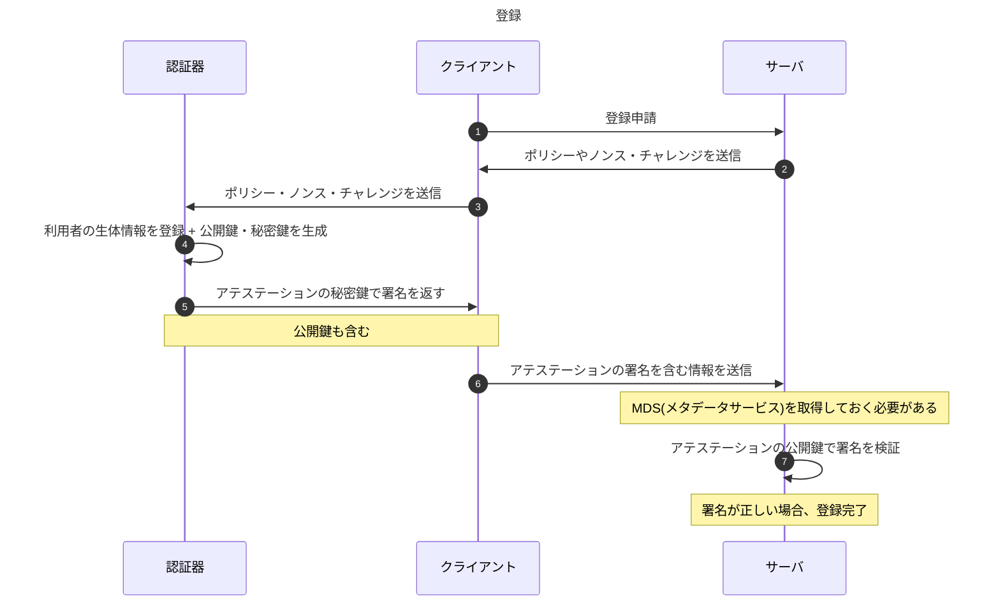
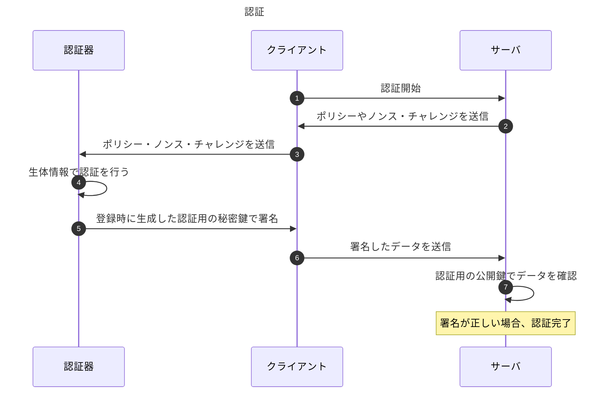

## FIDO関係

### FIDO

FIDO(Fast IDentity Online)は従来のパスワード形式での認証を行うのではなく、パスワードレスで認証を行う次世代の認証技術である。

パスワード認証ではパスワード漏洩の問題があり、それを補うために多要素認証が開発・導入された。多要素認証を導入により、安全性は増したが、利便性が低下してしまった。
FIDOでは安全性と利便性の両立を目指し、実現するために認証に多要素の中で一番情報流出が困難な`生体情報`と認証に必要な情報を通信するのではなく、トークンのみを通信する方針で実現している。

多要素認証は`知識情報`, `所持情報`, `生体情報`が存在し、`知識情報`はデータ流出等で漏れる可能性があり、`所持情報`は物理的に盗まれることで流出する可能性がある。しかし、`生体情報`は盗まれないとは言えないが、他の2つに比べて強固であることは明白である。

FIDOでは通信の傍受に対応するため、クライアントとサーバの通信では情報をやり取りするのではなく、トークンつまり計算結果のみをやり取りすることで、傍受されたとしても攻撃者には認証情報が漏れないようにしている。
具体的には公開暗号方式を用いて、サーバ側に公開鍵、クライアント側に秘密鍵を保管し、認証する際にはサーバ側がノンス・チャレンジ・乱数・ポリシーを送り、クライアント側で生体認証を行い、秘密鍵を用いて署名したデータをサーバに送信する。サーバ側では登録されている公開鍵を用いて署名確認を行い、送信したデータと一致しているか確認する。

秘密鍵の保管場所はクライアント側の`生体認証装置`内に保管する。これにより生体認証をパスしないとデータを取り出せない。

FIDOは[FIDO Alliance]によって仕様策定が行われている。

#### シーケンス図

実際の処理の流れとしては次の様になる。(参考: [Slide Share])

MDSは認証器のルート証明書や認証器の性能を格納したものであり、[MDS]からダウンロードすることができる。1ヶ月に1度データをダウンロードしキャッシュするのが良いと記載されている。

アテステーションは認証器のモデルに対する鍵を指す。つまり、同じモデルを使用している場合は同じ鍵を使用していると言うことになる。

### 仕様

FIDO Allianceでは3つの仕様を公開している。(参考: [仕様概要])

- U2F(Universal Second Factor): 二段階認証の追加
- UAF(Universal Authentication Framework): FIDO対応デバイスを使用してパスワードレスの認証を実現
- CTAP(the Client to Authenticator Protocols): FIDO アライアンスの対応するクライアント認証プロトコル

現在はFIDOはFIDO2であり、FIDO2はW3C ウェブ認証仕様(WebAuthn)とCTAPで構成されている。

[WebAuthn] は、FIDO認証のサポートを可能にするためにブラウザやプラットフォームに組み込まれている標準的なウェブAPIを定義している。
JavaScriptを用いて使用することができ、[MDN]で使用方法が記載されている。

## 参考

- [Wikipedia]
- [Slide Share]
- [FIDO Alliance]

[Wikipedia]: https://ja.wikipedia.org/wiki/FIDO_(%E8%AA%8D%E8%A8%BC%E6%8A%80%E8%A1%93)
[Slide Share]: https://www.slideshare.net/FIDOAlliance/fido-83445442
[FIDO Alliance]: https://fidoalliance.org/
[MDS]: https://fidoalliance.org/metadata/
[仕様概要]: https://fidoalliance.org/specifications-overview/?lang=ja
[WebAuthn]: https://www.w3.org/TR/webauthn-1/
[MDN]: https://developer.mozilla.org/ja/docs/Web/API/Web_Authentication_API
